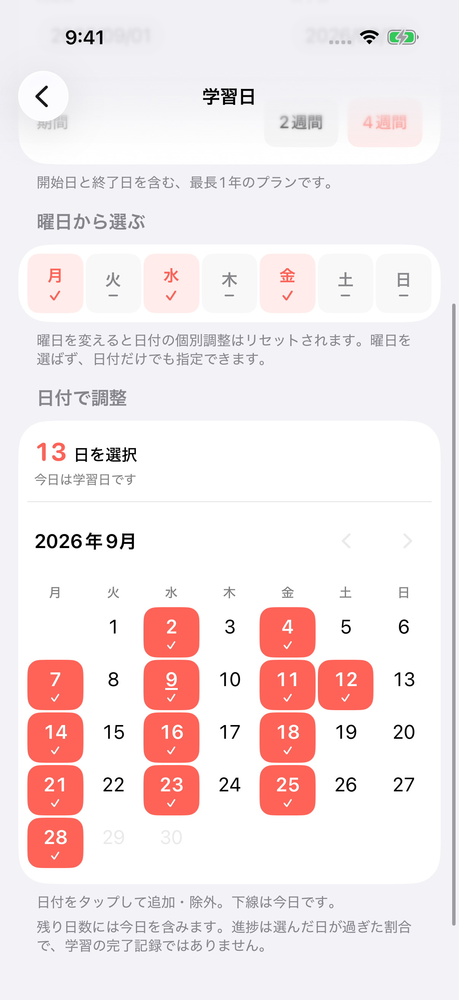
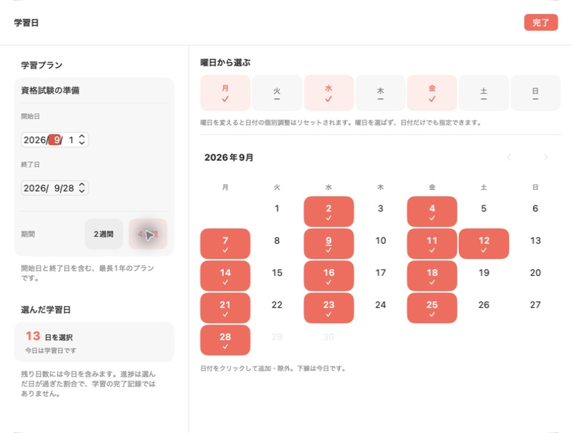

# 学習日タイマーのUI検証

2026-09-09。短期の学習予定で「学習できる日があと何日あるか」を表示する新しい時間項目。

## 操作と計算

- 「設定 → 時間の基準 → 学習日を選ぶ」（iOS）／「設定 → 時間 → 学習日を選ぶ」（macOS）から編集。
- 名前、開始日、終了日を指定。両端を含み、最長366日。2週間・4週間のショートカットあり。
- 曜日で一括選択後、カレンダーの日付で追加・除外。曜日をすべて外せば、日付だけの指定も可能。
- 曜日を変更すると日付の個別調整をリセットする。操作の直下に説明を表示。
- 残りは今日を含む選択日数。経過割合は「過去になった選択日数 ÷ 全選択日数」。実際の学習実績・完了記録ではない。
- 0日選択と、選択日がすべて経過した状態を別の文言で表示。日付が変わると更新。
- 初期状態は日付未選択。設定は端末内で自動保存。既存の時間選択は維持。ウィジェットとMacのサークルで新しく「学習日」を選択できる。

## UI上の判断

iOSは専用の編集画面で縦にスクロールする。タブバーを隠してカレンダーに使える高さを確保し、日付と曜日は44pt以上の操作領域を持つ。文字を拡大すると期間ボタンは必要に応じて縦配置となり、曜日・カレンダーは横にもスクロールできる。

macOSは820×620のシート。左側に名前・期間・選択日数、右側に曜日と月別カレンダーを配置。縦一列の初期試作では月の後半が隠れたため、この配置に変更した。6週ある月もスクロールせず確認できる。期間外の日付と移動できない月のボタンは無効。週の先頭はアプリの「週の始まり」に従う。

OSの予定表へのアクセスは行わず、アプリ内の選択用カレンダーを使用する。

## 検証

- Xcode 26.6、iOS Simulator 26.5、macOS 26.5.2。
- iPhone 17 Pro（402×874pt）：日本語・英語、曜日選択、個別日付の追加と除外、通常の設定画面からの移動、再表示後の選択維持をXCUITestで確認。
- 同シミュレータの最大アクセシビリティ文字サイズで曜日ボタンの操作を確認。実機VoiceOverの読み上げ確認は未実施。
- iPad mini (A17 Pro)（744×1133pt）：日本語、期間・曜日・月全体の表示を確認。
- ネイティブmacOS：日本語・英語、曜日切り替え、個別日付切り替え、期間変更、翌月移動、6週ある月を確認。
- `./build.sh test`：81件成功。`./build.sh test-mac`：142件成功。
- `DaysYetUI` scheme：3件成功。画像はXCUITest添付から取り出すか、実行中のアプリを撮影。
- 日付の単体テストは選択ルール、空状態、期間終了、うるう日、366日上限、旧プロファイルの移行、保存復元、タイムゾーン変更、夏時間を検証。深夜が飛ばされるAmerica/Santiagoも含む。

UIテストの実行例（SIMULATOR_IDは検証用iPhoneのID）：

```sh
xcodebuild -project DaysYet.xcodeproj -scheme DaysYetUI \
  -destination "platform=iOS Simulator,id=${SIMULATOR_ID}" \
  CODE_SIGNING_ALLOWED=NO test
```

## 画像

すべて架空の学習予定。ストア提出用の画像ではなく、このPRのUIレビュー用。

| iPhone・曜日と日付 | Mac・期間とカレンダー |
|---|---|
|  |  |

追加画像： [iPhoneの期間設定](screenshots/study-days/ios-ja-overview.png)・[iPhone English](screenshots/study-days/ios-en-calendar.png)・[Mac English](screenshots/study-days/macos-en.png)・[iPad](screenshots/study-days/ipad-ja.png)・[アプリ内のウィジェットプレビュー](screenshots/study-days/ios-widget-preview-ja.png)。
